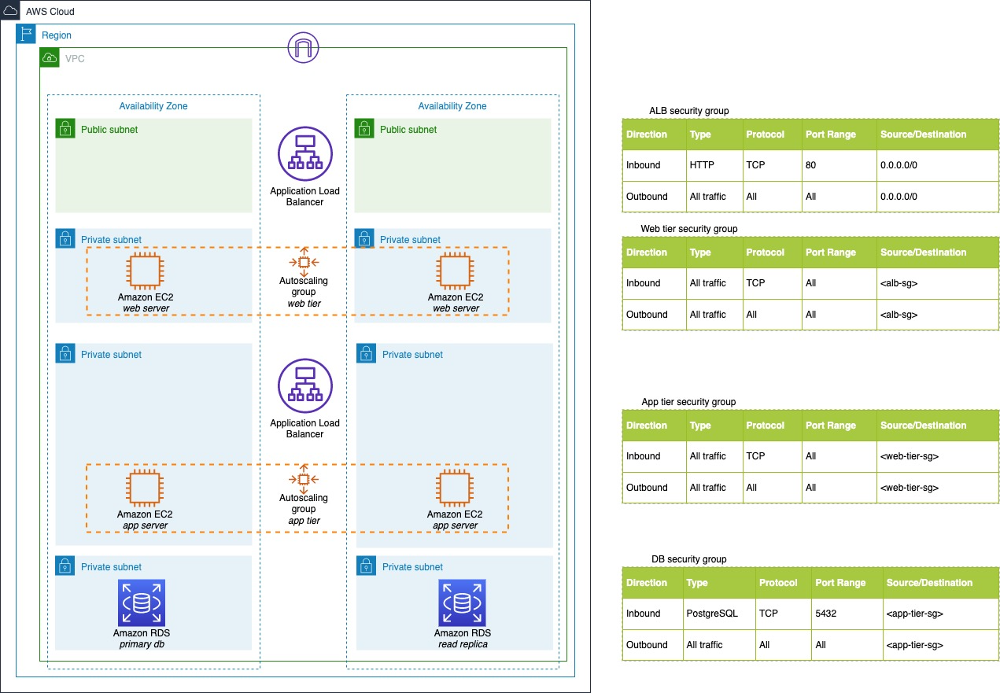

# ansible-aws-3tier-provision

Contains a playbook to deploy a simple 3-tier application on AWS

## Architecture

The deployment is loosely based on the graphic below, without the load balancer and auto-scaling groups. The playbook will deploy a single stack with the web tier in a public subnet.

